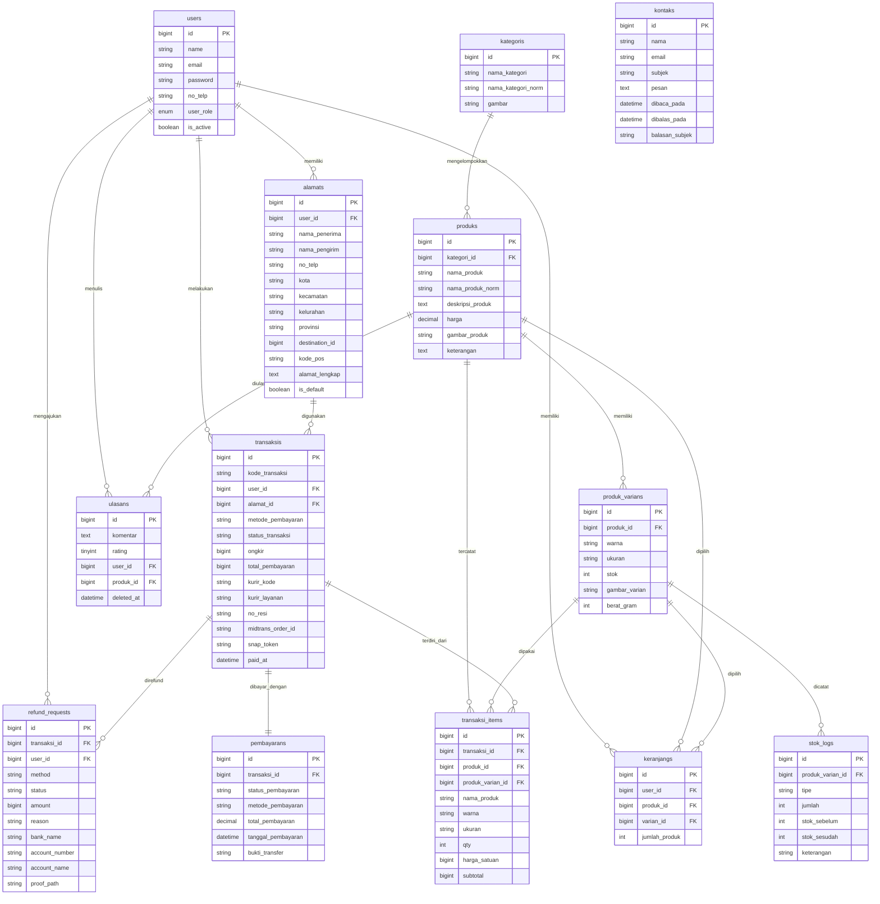

# ERD dan DFD Shoreline

Dokumen ini menyesuaikan ERD dan DFD dengan implementasi kode project `shoreline` saat ini.

## Catatan Penting

- Nama tabel database mengikuti Laravel migration, misalnya `users`, `produks`, `kategoris`, `transaksis`, dan `refund_requests`.
- Detail item pesanan aktif menggunakan `transaksi_items`.
- Tabel `detail_transaksis` tampak sebagai struktur lama dan bukan pusat alur transaksi saat ini.
- Sistem memiliki integrasi eksternal dengan Midtrans dan layanan ongkir/Komerce, jadi keduanya perlu masuk ke DFD.

## ERD Final

### Entitas dan atribut utama

#### 1. `users`

- `id` (PK)
- `name`
- `email`
- `email_verified_at`
- `password`
- `no_telp`
- `user_role`
- `is_active`
- `remember_token`
- `created_at`
- `updated_at`

#### 2. `alamats`

- `id` (PK)
- `user_id` (FK -> users.id)
- `nama_penerima`
- `nama_pengirim`
- `no_telp`
- `kota`
- `kecamatan`
- `kelurahan`
- `provinsi`
- `destination_id`
- `kode_pos`
- `alamat_lengkap`
- `is_default`
- `created_at`
- `updated_at`

#### 3. `kategoris`

- `id` (PK)
- `nama_kategori`
- `nama_kategori_norm`
- `gambar`
- `created_at`
- `updated_at`

#### 4. `produks`

- `id` (PK)
- `kategori_id` (FK -> kategoris.id)
- `nama_produk`
- `nama_produk_norm`
- `deskripsi_produk`
- `harga`
- `gambar_produk`
- `keterangan`
- `created_at`
- `updated_at`

#### 5. `produk_varians`

- `id` (PK)
- `produk_id` (FK -> produks.id)
- `warna`
- `ukuran`
- `stok`
- `gambar_varian`
- `berat_gram`
- `created_at`
- `updated_at`

#### 6. `keranjangs`

- `id` (PK)
- `user_id` (FK -> users.id)
- `produk_id` (FK -> produks.id)
- `varian_id` (FK -> produk_varians.id)
- `jumlah_produk`
- `created_at`
- `updated_at`

#### 7. `ulasans`

- `id` (PK)
- `komentar`
- `rating`
- `user_id` (FK -> users.id)
- `produk_id` (FK -> produks.id)
- `deleted_at`
- `created_at`
- `updated_at`

Catatan:
- Kombinasi `user_id + produk_id` bersifat unik.

#### 8. `transaksis`

- `id` (PK)
- `kode_transaksi`
- `user_id` (FK -> users.id)
- `alamat_id` (FK -> alamats.id)
- `metode_pembayaran`
- `status_transaksi`
- `stock_deducted`
- `stock_deducted_at`
- `ekspedisi`
- `ongkir`
- `kurir_kode`
- `kurir_layanan`
- `kurir_etd`
- `kurir_etd_is_business_days`
- `total_pembayaran`
- `payment_deadline`
- `no_resi`
- `tanggal_dikirim`
- `midtrans_order_id`
- `midtrans_transaction_id`
- `midtrans_payment_type`
- `snap_token`
- `paid_at`
- `shipping_nama_penerima`
- `shipping_nama_pengirim`
- `shipping_no_telp`
- `shipping_kota`
- `shipping_kecamatan`
- `shipping_kelurahan`
- `shipping_provinsi`
- `shipping_kode_pos`
- `shipping_alamat_lengkap`
- `shipping_destination_id`
- `created_at`
- `updated_at`

Catatan:
- Tabel ini menyimpan snapshot alamat pengiriman, bukan hanya relasi ke `alamats`.

#### 9. `transaksi_items`

- `id` (PK)
- `transaksi_id` (FK -> transaksis.id)
- `produk_id` (FK -> produks.id)
- `produk_varian_id` (FK -> produk_varians.id, nullable)
- `nama_produk`
- `warna`
- `ukuran`
- `qty`
- `harga_satuan`
- `subtotal`
- `created_at`
- `updated_at`

Catatan:
- `nama_produk`, `warna`, dan `ukuran` disimpan sebagai snapshot item saat checkout.

#### 10. `pembayarans`

- `id` (PK)
- `transaksi_id` (FK -> transaksis.id)
- `status_pembayaran`
- `metode_pembayaran`
- `total_pembayaran`
- `tanggal_pembayaran`
- `bukti_transfer`
- `created_at`
- `updated_at`

#### 11. `refund_requests`

- `id` (PK)
- `transaksi_id` (FK -> transaksis.id)
- `user_id` (FK -> users.id)
- `method`
- `status`
- `amount`
- `reason`
- `bank_name`
- `account_number`
- `account_name`
- `midtrans_response`
- `midtrans_refund_key`
- `midtrans_request`
- `synced_at`
- `stock_restored_at`
- `refunded_at`
- `proof_path`
- `created_at`
- `updated_at`

#### 12. `kontaks`

- `id` (PK)
- `nama`
- `email`
- `subjek`
- `pesan`
- `dibaca_pada`
- `dibalas_pada`
- `balasan_subjek`
- `created_at`
- `updated_at`

#### 13. `stok_logs`

- `id` (PK)
- `produk_varian_id` (FK -> produk_varians.id)
- `tipe`
- `jumlah`
- `stok_sebelum`
- `stok_sesudah`
- `keterangan`
- `created_at`
- `updated_at`

## Relasi ERD

- `users` 1..N `alamats`
- `users` 1..N `keranjangs`
- `users` 1..N `transaksis`
- `users` 1..N `ulasans`
- `users` 1..N `refund_requests`
- `kategoris` 1..N `produks`
- `produks` 1..N `produk_varians`
- `produks` 1..N `keranjangs`
- `produks` 1..N `ulasans`
- `produks` 1..N `transaksi_items`
- `produk_varians` 1..N `keranjangs`
- `produk_varians` 1..N `stok_logs`
- `produk_varians` 1..N `transaksi_items`
- `alamats` 1..N `transaksis`
- `transaksis` 1..N `transaksi_items`
- `transaksis` 1..1 `pembayarans`
- `transaksis` 1..N `refund_requests`

## Mermaid ERD



## DFD Final

### Entitas eksternal

- `Pelanggan`
- `Admin`
- `Midtrans`
- `Layanan Ongkir/Komerce`
- `Email Service`

### Data store

- `D1 Users`
- `D2 Alamat`
- `D3 Kategori`
- `D4 Produk`
- `D5 Produk Varian`
- `D6 Keranjang`
- `D7 Ulasan`
- `D8 Transaksi`
- `D9 Transaksi Item`
- `D10 Pembayaran`
- `D11 Refund Request`
- `D12 Kontak`
- `D13 Stok Log`

### Proses utama level 1

#### P1. Autentikasi dan Kelola Pengguna

- Pelanggan mengirim data register dan login
- Sistem menyimpan dan membaca `Users`
- Admin mengelola status aktif dan role pengguna

#### P2. Kelola Alamat

- Pelanggan menambah, mengubah, menghapus, dan memilih alamat default
- Sistem menyimpan data ke `Alamat`
- Sistem memakai data alamat untuk checkout

#### P3. Kelola Kategori

- Admin menambah, mengubah, dan menghapus kategori
- Sistem menyimpan ke `Kategori`

#### P4. Kelola Produk dan Varian

- Admin mengelola produk
- Admin mengelola varian produk
- Sistem menyimpan ke `Produk` dan `Produk Varian`
- Perubahan stok tercatat ke `Stok Log`

#### P5. Kelola Keranjang

- Pelanggan menambahkan produk varian ke keranjang
- Sistem membaca `Produk` dan `Produk Varian`
- Sistem menyimpan ke `Keranjang`

#### P6. Checkout dan Pengiriman

- Pelanggan memilih item checkout, alamat, metode pembayaran, dan kurir
- Sistem membaca `Keranjang`, `Alamat`, `Produk`, dan `Produk Varian`
- Sistem meminta ongkir ke `Layanan Ongkir/Komerce`
- Sistem menyimpan `Transaksi` dan `Transaksi Item`
- Sistem membentuk snapshot alamat pengiriman dalam `Transaksi`

#### P7. Kelola Pembayaran

- Pelanggan upload bukti transfer atau QRIS untuk metode manual
- Sistem menyimpan ke `Pembayaran`
- Untuk Midtrans, sistem mengirim transaksi ke `Midtrans`
- `Midtrans` mengirim webhook balik ke sistem
- Sistem memperbarui `Pembayaran` dan `Transaksi`

#### P8. Kelola Status Pesanan

- Admin memverifikasi pembayaran manual
- Admin mengubah status pesanan
- Admin menginput resi pengiriman
- Sistem memperbarui `Transaksi`
- Sistem mencatat pengurangan atau pemulihan stok ke `Stok Log`

#### P9. Kelola Ulasan

- Pelanggan memberi ulasan setelah pembelian
- Sistem membaca riwayat pembelian dari `Transaksi` dan `Transaksi Item`
- Sistem menyimpan ulasan ke `Ulasan`
- Admin dapat menghapus atau me-restore ulasan

#### P10. Kelola Kontak

- Pelanggan mengirim pesan kontak
- Sistem menyimpan ke `Kontak`
- Sistem mengirim notifikasi email ke admin
- Admin membaca dan membalas pesan
- Sistem memperbarui status dibaca dan dibalas

#### P11. Kelola Refund

- Pelanggan mengajukan refund
- Sistem menyimpan ke `Refund Request`
- Admin memproses atau memfinalisasi refund manual
- Untuk refund Midtrans, sistem berinteraksi dengan `Midtrans`
- Sistem memperbarui `Refund Request`, `Pembayaran`, `Transaksi`, dan bila perlu `Stok Log`

#### P12. Laporan Pendapatan

- Admin meminta laporan pendapatan
- Sistem membaca `Transaksi` dan `Pembayaran`
- Sistem menghasilkan data laporan

## Mermaid DFD Konseptual

```mermaid
flowchart TD
    Pelanggan[Pelanggan]
    Admin[Admin]
    Midtrans[Midtrans]
    Ongkir[Layanan Ongkir/Komerce]
    Email[Email Service]

    P1[Autentikasi dan Kelola Pengguna]
    P2[Kelola Alamat]
    P3[Kelola Kategori]
    P4[Kelola Produk dan Varian]
    P5[Kelola Keranjang]
    P6[Checkout dan Pengiriman]
    P7[Kelola Pembayaran]
    P8[Kelola Status Pesanan]
    P9[Kelola Ulasan]
    P10[Kelola Kontak]
    P11[Kelola Refund]
    P12[Laporan Pendapatan]

    D1[(Users)]
    D2[(Alamat)]
    D3[(Kategori)]
    D4[(Produk)]
    D5[(Produk Varian)]
    D6[(Keranjang)]
    D7[(Ulasan)]
    D8[(Transaksi)]
    D9[(Transaksi Item)]
    D10[(Pembayaran)]
    D11[(Refund Request)]
    D12[(Kontak)]
    D13[(Stok Log)]

    Pelanggan --> P1
    Pelanggan --> P2
    Pelanggan --> P5
    Pelanggan --> P6
    Pelanggan --> P7
    Pelanggan --> P9
    Pelanggan --> P10
    Pelanggan --> P11

    Admin --> P1
    Admin --> P3
    Admin --> P4
    Admin --> P8
    Admin --> P10
    Admin --> P11
    Admin --> P12

    P1 <--> D1
    P2 <--> D2
    P3 <--> D3
    P4 <--> D4
    P4 <--> D5
    P4 <--> D13
    P5 <--> D4
    P5 <--> D5
    P5 <--> D6
    P6 <--> D2
    P6 <--> D4
    P6 <--> D5
    P6 <--> D6
    P6 <--> D8
    P6 <--> D9
    P6 <--> Ongkir
    P7 <--> D8
    P7 <--> D10
    P7 <--> Midtrans
    P8 <--> D8
    P8 <--> D10
    P8 <--> D13
    P9 <--> D7
    P9 <--> D8
    P9 <--> D9
    P10 <--> D12
    P10 <--> Email
    P11 <--> D8
    P11 <--> D10
    P11 <--> D11
    P11 <--> D13
    P11 <--> Midtrans
    P12 <--> D8
    P12 <--> D10
```



## Saran Untuk Digambar Ulang di draw.io

1. Pakai `transaksi_items`, bukan `detail_transaksis`, sebagai detail pesanan utama.
2. Tampilkan `Midtrans` dan `Layanan Ongkir/Komerce` sebagai entitas eksternal pada DFD.
3. Pada ERD, `transaksis` sebaiknya diberi catatan bahwa ia menyimpan snapshot alamat pengiriman.
4. Untuk `refund`, gunakan nama `refund_requests` agar sama dengan database.
5. Pada `kontaks`, gunakan `balasan_subjek`, bukan kolom `balasan` bebas, karena yang tersimpan di database saat ini adalah subjek balasan dan timestamp balasan.

## Blueprint Gambar Ulang di draw.io

Bagian ini disusun agar diagram mudah digambar ulang dengan posisi yang rapi dan minim garis silang.

### A. Layout ERD yang disarankan

Gunakan pola `kiri -> tengah -> kanan` dengan `transaksis` sebagai pusat.

#### Kolom kiri: master pengguna

Urutan dari atas ke bawah:

1. `users`
2. `alamats`
3. `keranjangs`
4. `ulasans`
5. `kontaks`

Relasi yang keluar dari area ini:

- `users -> alamats`
- `users -> keranjangs`
- `users -> ulasans`
- `users -> transaksis`
- `users -> refund_requests`

Catatan:

- `kontaks` sebaiknya berdiri sendiri di kiri bawah karena tidak punya FK langsung ke tabel lain.

#### Kolom tengah: inti transaksi

Urutan dari atas ke bawah:

1. `transaksis`
2. `transaksi_items`
3. `pembayarans`
4. `refund_requests`

Relasi inti:

- `alamats -> transaksis`
- `transaksis -> transaksi_items`
- `transaksis -> pembayarans`
- `transaksis -> refund_requests`

Catatan:

- Jadikan `transaksis` kotak paling besar atau paling menonjol karena ini pusat alur sistem.
- Letakkan `pembayarans` di kanan bawah atau tepat bawah `transaksis`.
- Letakkan `refund_requests` di bawah `pembayarans` agar relasi refund mudah dibaca.

#### Kolom kanan: master produk

Urutan dari atas ke bawah:

1. `kategoris`
2. `produks`
3. `produk_varians`
4. `stok_logs`

Relasi inti:

- `kategoris -> produks`
- `produks -> produk_varians`
- `produk_varians -> stok_logs`
- `produks -> keranjangs`
- `produks -> ulasans`
- `produks -> transaksi_items`
- `produk_varians -> keranjangs`
- `produk_varians -> transaksi_items`

Catatan:

- `stok_logs` paling enak ditempatkan di kanan bawah dekat `produk_varians`.

### B. Urutan gambar ERD di draw.io

Supaya cepat dan rapi, gambar dengan urutan ini:

1. Gambar `transaksis` di tengah.
2. Gambar `transaksi_items`, `pembayarans`, dan `refund_requests` di sekitar `transaksis`.
3. Gambar `users` dan `alamats` di sisi kiri.
4. Gambar `kategoris`, `produks`, `produk_varians`, dan `stok_logs` di sisi kanan.
5. Tambahkan `keranjangs` di kiri tengah.
6. Tambahkan `ulasans` di kiri bawah atau tengah bawah.
7. Tambahkan `kontaks` terpisah di kiri bawah.
8. Hubungkan relasi satu per satu mulai dari pusat ke pinggir.

### C. Bentuk relasi ERD yang paling enak dibaca

Kalau memakai Crow's Foot:

- `users` 1 ---- N `alamats`
- `users` 1 ---- N `keranjangs`
- `users` 1 ---- N `transaksis`
- `users` 1 ---- N `ulasans`
- `users` 1 ---- N `refund_requests`
- `kategoris` 1 ---- N `produks`
- `produks` 1 ---- N `produk_varians`
- `produks` 1 ---- N `keranjangs`
- `produks` 1 ---- N `ulasans`
- `produks` 1 ---- N `transaksi_items`
- `produk_varians` 1 ---- N `keranjangs`
- `produk_varians` 1 ---- N `stok_logs`
- `produk_varians` 1 ---- N `transaksi_items`
- `alamats` 1 ---- N `transaksis`
- `transaksis` 1 ---- N `transaksi_items`
- `transaksis` 1 ---- 1 `pembayarans`
- `transaksis` 1 ---- N `refund_requests`

### D. Template visual ERD yang disarankan

Gunakan isi tiap entitas seperti ini:

```text
transaksis
-----------
PK id
FK user_id
FK alamat_id
kode_transaksi
metode_pembayaran
status_transaksi
ongkir
total_pembayaran
kurir_kode
kurir_layanan
payment_deadline
no_resi
paid_at
midtrans_order_id
...
```

Aturan praktis:

- Baris pertama: nama tabel
- Bagian kedua: PK dan FK
- Bagian ketiga: atribut utama
- Atribut snapshot yang terlalu banyak seperti `shipping_*` boleh dipersingkat dengan `shipping_* snapshot`

### E. Layout DFD level 0 yang disarankan

Kalau Anda mau membuat DFD konteks atau level 0, cukup buat satu proses besar di tengah:

- `Sistem Toko Online Shoreline`

Posisi aktor:

- `Pelanggan` di kiri
- `Admin` di kanan
- `Midtrans` di kanan atas
- `Layanan Ongkir/Komerce` di kiri atas
- `Email Service` di bawah

Arus data utama:

- `Pelanggan -> Sistem`: registrasi, login, pilih produk, checkout, upload pembayaran, ulasan, kontak, refund
- `Sistem -> Pelanggan`: informasi produk, status pesanan, notifikasi
- `Admin -> Sistem`: kelola produk, kategori, stok, transaksi, pembayaran, refund, kontak
- `Sistem -> Admin`: laporan, notifikasi, data pesanan, data kontak
- `Sistem <-> Midtrans`: transaksi pembayaran, webhook status
- `Sistem <-> Layanan Ongkir/Komerce`: cek ongkir, data pengiriman
- `Sistem <-> Email Service`: kirim email notifikasi dan balasan

### F. Layout DFD level 1 yang paling enak digambar

Gunakan susunan 3 baris.

#### Baris atas: master data

- `P1 Kelola Pengguna`
- `P2 Kelola Alamat`
- `P3 Kelola Kategori`
- `P4 Kelola Produk dan Varian`

#### Baris tengah: transaksi inti

- `P5 Kelola Keranjang`
- `P6 Checkout dan Pengiriman`
- `P7 Kelola Pembayaran`
- `P8 Kelola Status Pesanan`

#### Baris bawah: layanan pendukung

- `P9 Kelola Ulasan`
- `P10 Kelola Kontak`
- `P11 Kelola Refund`
- `P12 Laporan Pendapatan`

Data store letakkan di bawah proses yang paling dekat:

- `D1 Users` di bawah `P1`
- `D2 Alamat` di bawah `P2`
- `D3 Kategori`, `D4 Produk`, `D5 Produk Varian`, `D13 Stok Log` di bawah `P4`
- `D6 Keranjang` di bawah `P5`
- `D8 Transaksi` dan `D9 Transaksi Item` di bawah `P6`
- `D10 Pembayaran` di bawah `P7`
- `D7 Ulasan` di bawah `P9`
- `D12 Kontak` di bawah `P10`
- `D11 Refund Request` di bawah `P11`

### G. Urutan gambar DFD level 1 di draw.io

1. Tempatkan semua entitas eksternal dulu.
2. Tempatkan 12 proses utama dalam 3 baris.
3. Letakkan data store tepat di bawah proses yang paling sering mengaksesnya.
4. Hubungkan aktor ke proses.
5. Hubungkan proses ke data store.
6. Hubungkan proses ke layanan eksternal terakhir.

### H. Versi paling sederhana untuk laporan

Kalau diagram harus muat satu halaman dan tidak terlalu padat:

- ERD: tampilkan 10 tabel inti saja:
  - `users`
  - `alamats`
  - `kategoris`
  - `produks`
  - `produk_varians`
  - `keranjangs`
  - `transaksis`
  - `transaksi_items`
  - `pembayarans`
  - `refund_requests`
- `ulasans`, `kontaks`, dan `stok_logs` bisa dibuat sebagai entitas tambahan di sisi bawah.
- Di DFD level 1, gabungkan proses kecil:
  - `Kelola Master Data`
  - `Kelola Belanja`
  - `Kelola Pembayaran`
  - `Kelola Layanan Pelanggan`
  - `Laporan`

### I. Rekomendasi style draw.io

- Warna entitas ERD: biru muda
- Warna proses DFD: putih atau abu terang
- Warna data store: kuning muda
- Warna entitas eksternal: hijau muda
- Gunakan konektor orthogonal atau elbow agar garis lebih rapi
- Hindari garis diagonal panjang
- Gunakan ukuran kotak yang konsisten per kelompok
- Tulis PK/FK dengan singkatan kecil agar tidak memenuhi kotak
